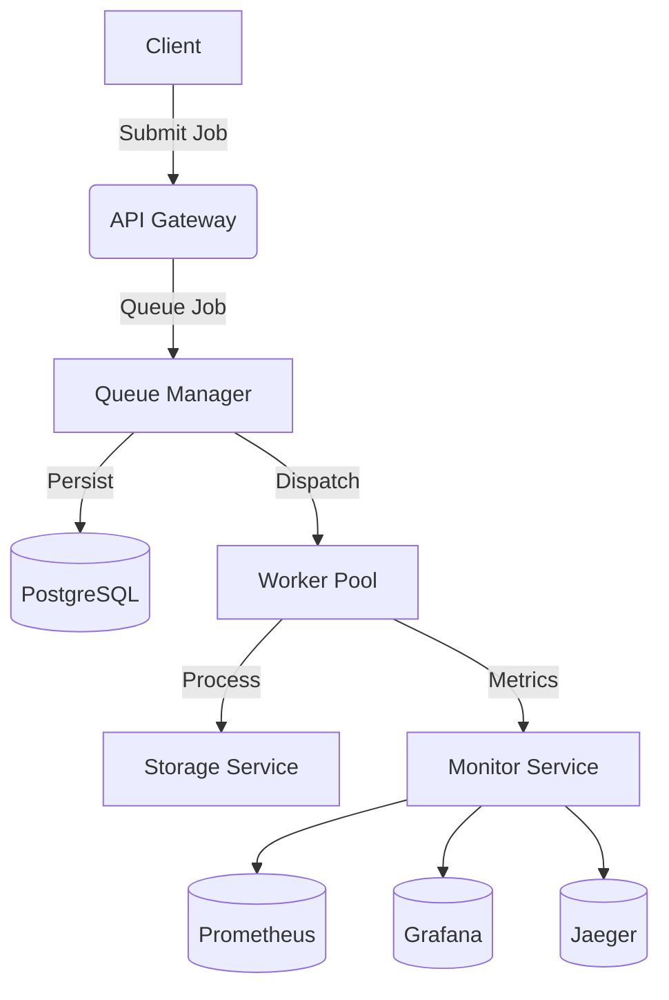

# Distributed Task Queue System

<!-- Badges -->


A high-performance distributed task queue system built with Go, featuring worker pools, priority queues, and full observability.

## 🌟 Features

- **Distributed Architecture**: Microservices with clear separation of concerns
- **Multi-priority Queues**: Urgent/high/medium/low priority job handling
- **Resilient Processing**:
  - Exponential backoff retries
  - Dead letter queue for failed jobs
  - Circuit breakers for dependencies
- **Observability**:
  - Prometheus metrics endpoint
  - Grafana dashboards
  - Distributed tracing with Jaeger
- **Scalable**: Horizontally scalable worker pools
- **Modern Stack**:
  - gRPC for inter-service communication
  - Redis/RabbitMQ for queue management
  - PostgreSQL for persistence

## 🏗️ Architecture



## 🚀 Getting Started

### Prerequisites

- Go 1.24+
- Docker 20.10+
- make
- Redis 7.0+

### Quick Start

```bash
# Clone the repository
git clone https://github.com/salgue441/task-queue.git
cd task-queue

# Start services
make docker-up

# Submit a test job
curl -X POST http://localhost:8080/jobs \
  -H "Content-Type: application/json" \
  -d '{"type":"email","payload":{"to":"user@example.com"}}'
```

### Directory Structure

```bash
├── api # Protocol definitions
├── cmd # Service entrypoints
│ ├── apigateway
│ ├── monitor
│ ├── queue
│ └── worker
├── configs # Deployment configurations
├── internal # Core application logic
│ ├── job # Job processing
│ ├── metrics # Monitoring
│ └── queue # Queue implementations
├── scripts # Utility scripts
└── deployments # Kubernetes/Cloud configs
```

## 📄 License

Distributed under the MIT License. See [LICENSE](LICENSE) for more information.
