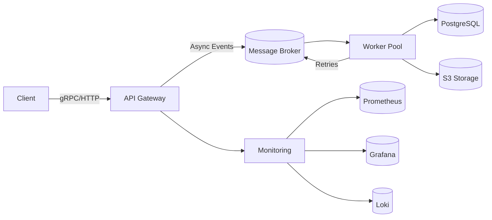

# Distributed Task Queue System

<!-- Badges -->

[](https://golang.org)
[](https://github.com/salgue441/task-queue/actions)
[](https://codecov.io/gh/salgue441/task-queue)

A high-performance distributed task queue system built with Go, featuring worker pools, priority queues, and full observability.

## 🌟 Features

### 🚀 Core Capabilities

- **Distributed Task Processing**: Horizontally scalable architecture with auto-discovery
- **Multi-Priority Queues**:
  - 🚨 Urgent (real-time)
  - 🔥 High
  - ⏳ Medium
  - 🐢 Low
- **Dynamic Worker Pools**: Automatic scaling based on queue depth and system load

### 🔄 Resilience

- **Intelligent Retries**: Exponential backoff with jitter algorithm
- **Dead Letter Queues**: Automatic quarantine for failed jobs with manual replay
- **Circuit Breakers**: Automatic service degradation for dependencies
- **Exactly-Once Processing**: Deduplication via idempotency keys

### 📊 Observability

- **Real-time Metrics**:
  - Prometheus endpoint with custom exporters
  - Grafana dashboards pre-configured
- **Distributed Tracing**: Jaeger/Zipkin integration with context propagation
- **Structured Logging**: Loki/ELK compatible JSON logs with correlation IDs

### ⚡ Modern Integrations

- **Protocol Support**:
  - gRPC (high-performance)
  - REST/Webhooks (compatibility)
  - WebSockets (real-time updates)
- **Storage Backends**:
  - Redis Streams
  - RabbitMQ
  - PostgreSQL (for persistent queues)
  - S3/GCS (for large payloads)

### 🔐 Enterprise Ready

- **Security**:
  - TLS/mTLS encryption
  - OAuth2/JWT authentication
  - Payload encryption at rest
- **Multi-Cloud**:
  - Kubernetes operator included
  - Terraform modules for AWS/GCP/Azure
  - Helm charts for easy deployment

### 🌱 Eco-System

- **Web UI**: Management console with queue visualization
- **CLI Tool**: `taskctl` for administration
- **WebAssembly Workers**: Edge computing support
- **Plugin System**: Custom processors via Go/Wasm plugins

## 🏗️ Architecture



## 🚀 Getting Started

### Prerequisites

- Go 1.24+
- Docker 20.10+
- make
- Redis 7.0+

### Quick Start

```bash
# Clone the repository
git clone https://github.com/salgue441/task-queue.git
cd task-queue

# Start services
make docker-up

# Submit a test job
curl -X POST http://localhost:8080/jobs \
  -H "Content-Type: application/json" \
  -d '{"type":"email","payload":{"to":"user@example.com"}}'
```

### Directory Structure

```bash
├── api # Protocol definitions
├── cmd # Service entrypoints
│ ├── apigateway
│ ├── monitor
│ ├── queue
│ └── worker
├── configs # Deployment configurations
├── internal # Core application logic
│ ├── job # Job processing
│ ├── metrics # Monitoring
│ └── queue # Queue implementations
├── scripts # Utility scripts
└── deployments # Kubernetes/Cloud configs
```

## 📄 License

Distributed under the MIT License. See [LICENSE](LICENSE) for more information.
